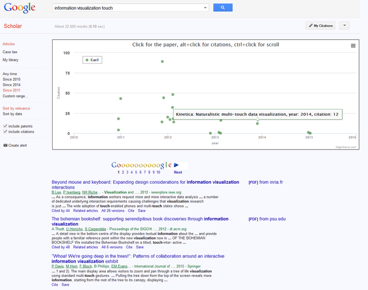

# ScholarChart
ScholarChart: a charting userscript for Google Scholar distinguishing articles by the publication year and the number of citations

You can use GreaseMonkey extension in Firefox or Tampermonkey for Chrome to install and use it. After installing the script, you just need to go to "scholar.google.com" and search for something to see the results.

Firefox's GreaseMonkey is available here:
https://addons.mozilla.org/en-Us/firefox/addon/greasemonkey/

and Chrome's TamperMonkey:
https://chrome.google.com/webstore/detail/dhdgffkkebhmkfjojejmpbldmpobfkfo

